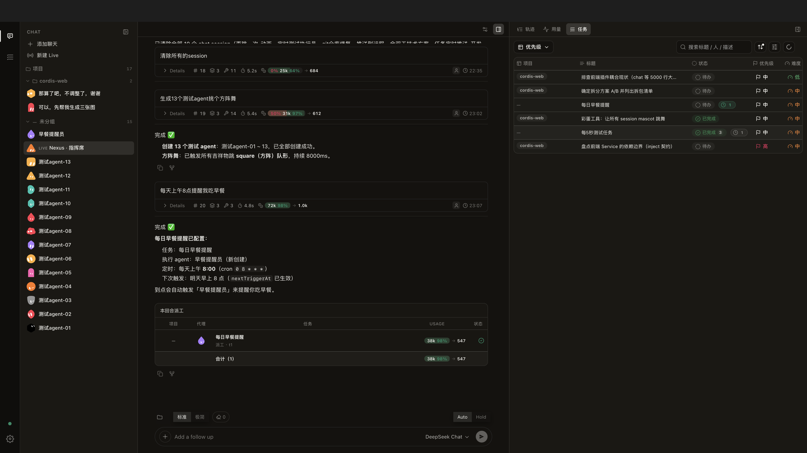
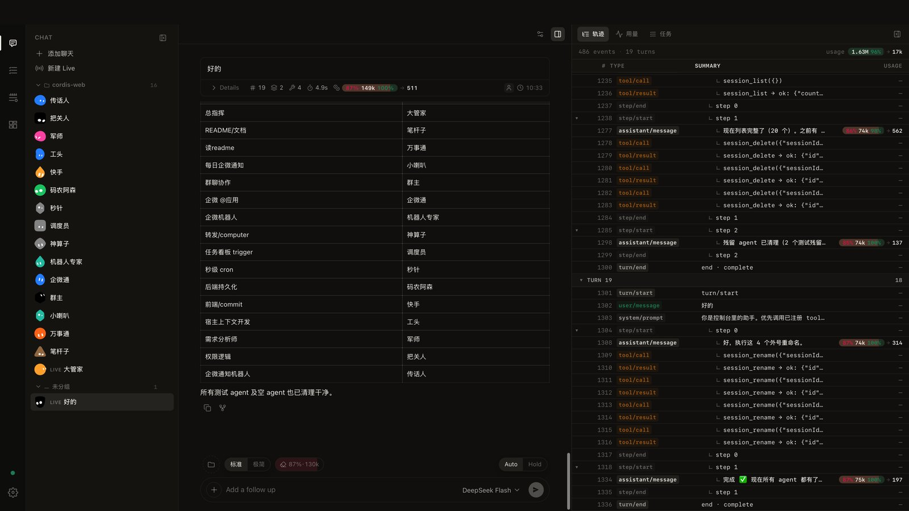
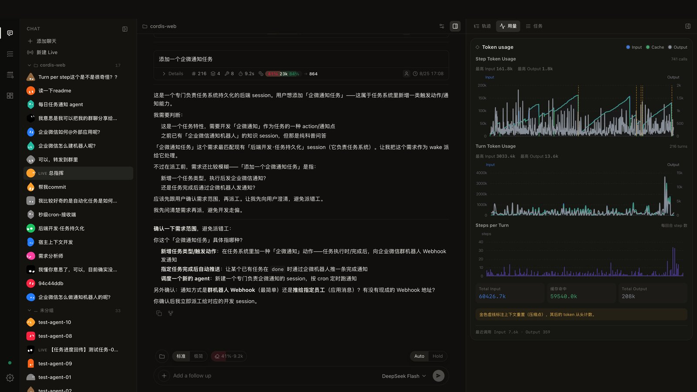
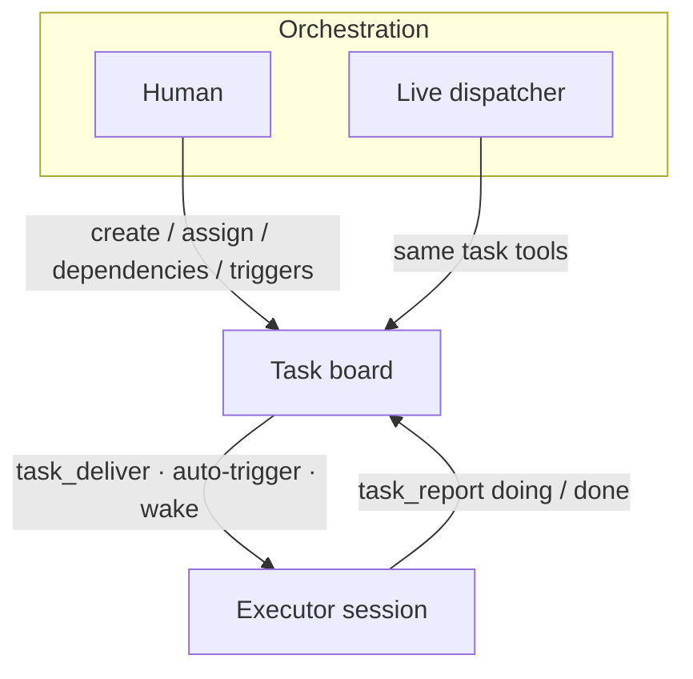
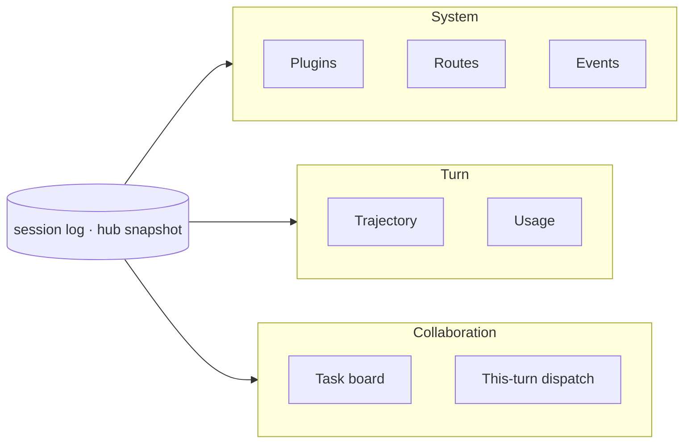
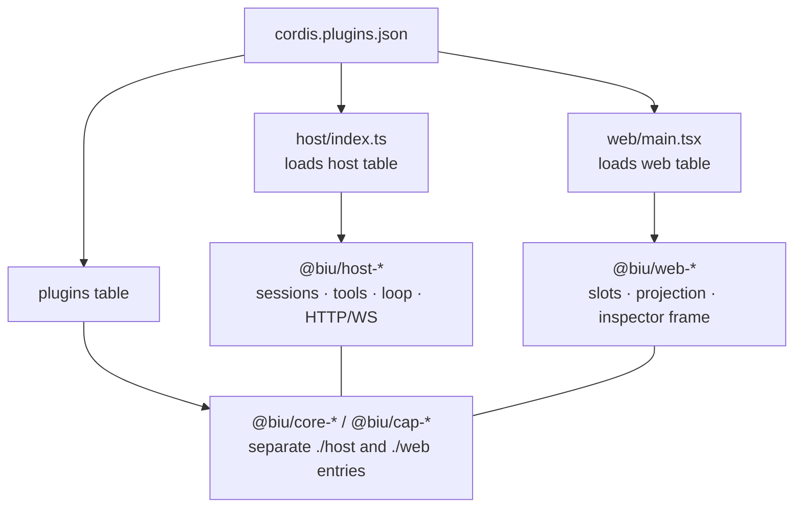

<div align="center">

<p>
  
</p>

# Biu Agent OS

**English** · [简体中文](README.zh-CN.md)

A pluggable, self-hosted agent OS.  

</div>

<p align="center">
  
  
  
  
</p>

**Biu Agent OS** is a local workbench that treats agents as processes and the task board as the bus between them. Agents run as independent sessions — each with its own workspace, model, and tool set — while a board coordinates multi-agent work. The kernel is Cordis: HTTP, sessions, LLM, chat, and the board are all plugins loaded from a single manifest, [`cordis.plugins.json`](cordis.plugins.json).

---

## Table of Contents

- [Biu Agent OS](#biu-agent-os)
  - [Table of Contents](#table-of-contents)
  - [Design Principles](#design-principles)
    - [1. Everything is a plugin](#1-everything-is-a-plugin)
    - [2. Multi-agent collaboration](#2-multi-agent-collaboration)
    - [3. Agent-native](#3-agent-native)
    - [4. Full observability](#4-full-observability)
  - [Demo](#demo)
  - [Multi-Agent Collaboration](#multi-agent-collaboration)
    - [First-run flow](#first-run-flow)
    - [Humans and agents share one board](#humans-and-agents-share-one-board)
  - [Observability](#observability)
  - [Architecture](#architecture)
  - [Repository Layout](#repository-layout)
  - [Quick Start](#quick-start)
  - [License](#license)

---

## Design Principles

| Principle | Core idea |
| --- | --- |
| Everything is a plugin | Kernel and capabilities are decoupled; each capability declares only the services it injects |
| Multi-agent collaboration | Agents are independent sessions; the task board is the bus between them |
| Agent-native | Agents govern agents: create, tag, inspect, and dispatch other agents programmatically |
| Full observability | One append-only event stream records every action; every screen is its projection |

### 1. Everything is a plugin

Built on Cordis: each capability declares only the services it injects, and unplugging a capability removes its features — the shell knows slots, not business concepts.

### 2. Multi-agent collaboration

Each agent is an independent session; the task board is the bus between them. Cards, assignment, dispatch, and `task_report` callbacks all happen on the board.

### 3. Agent-native

Agents are first-class objects: an agent can create, tag, inspect, and dispatch other agents programmatically.

### 4. Full observability

One append-only event stream records every action; observation and execution share the same source of truth, and every screen is a projection of it. A session is the authoritative log — projection can be swapped, the log cannot be lost.

---

## Demo

Three screens of the same workspace: the task board, and an executor session's trajectory and token usage.

<p align="center">
  
</p>
<p align="center"><sub><code>task.png</code> — Agents report on the board; chat progress flows back, queue keeps todo/done in sync</sub></p>

<p align="center">
  
</p>
<p align="center"><sub><code>trajectory.jpg</code> — Inspector "Trajectory" reconstructs a full turn from event projection: model output, tool calls, approvals, dispatch</sub></p>

<p align="center">
  
</p>
<p align="center"><sub><code>usage.jpg</code> — Inspector "Usage" shows token consumption; <code>task_report</code> pins the turn's usage</sub></p>

---

## Multi-Agent Collaboration

Executor sessions are independent sessions; the board is the bus between them.



Live handles the **live view** (who is running, whether to wake again); the board handles **work items** (who owns what, where it is stuck, when to dispatch next). Most products have either chat or scheduling; few have a board between them.

### First-run flow

1. Open a **Live** session as the dispatcher, plus one or more **chat** sessions as executors.
2. Open **Tasks** in the sidebar, create a card, and assign it to an executor session.
3. A human or the dispatcher calls `task_deliver` — or triggers via cron / `dep:done` / `turn:end` — to wake the executor.
4. The executor runs the task and calls `task_report` each turn: `doing` while in progress, `done` when finished (progress, notes, and turn usage are recorded on the card).
5. Use the inspector to view **Trajectory** and the linked **task** side by side. An upstream `done` can auto-trigger downstream work.

### Humans and agents share one board

| | Human | Agent |
| --- | --- | --- |
| Create card / reassign / inspect blocks | Tasks UI | `tasks_list` · `tasks_update` |
| Assign to a session | Set `assigneeSessionId` | Same; executor must be a real session, not a role name |
| Kick off | Trigger or manual | `task_deliver` |
| Report | Report timeline on board | `task_report` |
| Live steering | Switch to that session | Live: `session_wake` / `session_inject` |

Dependencies form a graph: `parentId` / `dependsOn` derive the blocking chain. Triggers share one state machine: `idle → pending → delivered → done`. Deleting an executor session keeps the card's report history intact.

---

## Observability

The harness answers four questions on its runtime surface — what is loaded, what was dispatched, what this turn did, and where collaboration is stuck — without digging into logs.



| Layer | Question | Entry |
| --- | --- | --- |
| System | Which plugins run, can they be hot-unloaded | Settings → Plugins |
| System | Which HTTP routes does host expose | Settings → Routes |
| System | What Cordis just dispatched | Settings → Events (stream chunks filtered) |
| Turn | What model / tools did step by step | Inspector **Trajectory** (event projection, not a chat copy) |
| Turn | How tokens were spent | Inspector **Usage**; `task_report` pins the turn's cost |
| Collaboration | Who owns which card | Tasks + inspector task page; dispatch table in Live chat |
| Collaboration | Is this tool set valid for the session | Session config / `GET /api/sessions/:id/inspector` |

Plugin (un)load is reflected in the snapshot immediately — plugin table, routes, tool names. The UI only subscribes; it never infers.

---

## Architecture



- **The shell only knows slots.** `composer`, `inspector-panels`, `app-modules`, and Settings panels are `place`d by capabilities. Dashboard / Tasks / Channels in the activity bar are cap-registered modules.
- **The agent loop is replaceable.** The `agents` handle stays; the factory can be swapped.
- **Approval sits on the pipeline.** Sensitive tools enter a `hold` state; the approval UI docks without merging into shell logic.

| Table | Loaded by | Hot-unloadable |
| --- | --- | --- |
| `host` | `host/index.ts` | No (kernel) |
| `web` | `web/main.tsx` | No (shell) |
| `plugins` | hub + ui-hub | Yes |

Adding a capability: create `packages/cap-<id>`, split `exports` into `./host` and `./web`, append to the `plugins` table, restart. `type-*` and `web-mascot` stay out of the table. Details: [docs/plugin-packages.md](docs/plugin-packages.md).

---

## Repository Layout

The root keeps only loaders and the manifest; all capabilities live in `packages/`, distinguished by prefix.

```
biu-harness
├── host/                      # Node loader: reads the host table from json, plugin()
│   ├── index.ts
│   └── types.ts
├── web/                       # Browser loader: reads the web table from json
│   ├── main.tsx
│   ├── style.css
│   └── types.ts
├── index.html                 # Vite entry → web/main.tsx
├── cordis.plugins.json        # Single plugin manifest (host / web / plugins tables)
├── Makefile                   # make / make stop / make restart
├── vite.config.ts
├── LICENSE                    # MIT (excluding Grok Bot character assets)
├── NOTICE.md                  # Third-party character notice
├── docs/
│   ├── plugin-packages.md     # Package prefix and entry conventions
│   └── demo/                  # README screenshots: task / trajectory / usage
├── scripts/
│   └── link-cordis-plugins.mjs
├── public/
│   ├── favicon.svg            # Brand mascot (sidebar gradient)
│   ├── brand-lockup.svg       # README: mascot + Biu Agent OS tag
│   ├── mascot-blue.svg        # README mascots (BMW M tricolor)
│   ├── mascot-violet.svg
│   ├── mascot-red.svg
│   └── grok-bot/              # Non-MIT: xAI character geometry replica
└── packages/
    ├── type-session/          # Contracts; not in json
    ├── type-http/
    ├── type-slots/
    ├── type-agent-loop/
    ├── type-host-context/
    │
    ├── host-plugin-loader/    # Parses json, Vite virtual modules
    ├── host-http/             # HTTP / WS
    ├── host-session-store/
    ├── host-sessions/         # Append-only session + ALS
    ├── host-tools/
    ├── host-llm/
    ├── host-system-prompt/
    ├── host-fs/
    ├── host-sandbox/
    ├── host-subprocess/
    ├── host-shell/
    ├── host-jobs/
    ├── host-mcp/
    ├── host-terminal/
    ├── host-lsp/
    ├── host-context/
    ├── host-approvals/
    ├── host-agent-loop/
    ├── host-agents/
    ├── host-subagents/
    ├── host-live-sessions/    # Live dispatch (not a task plugin)
    ├── host-hub/              # Mounts plugins table, snapshot
    │
    ├── web-slots/
    ├── web-app-modules/
    ├── web-session-view/
    ├── web-project-view/
    ├── web-snapshot/
    ├── web-react-host/
    ├── web-app-shell/         # App shell, inspector frame
    ├── web-plugin-tree/       # Settings → Plugins
    ├── web-event-log/         # Settings → Events
    ├── web-routes-panel/      # Settings → Routes
    ├── web-ui-hub/
    ├── web-mascot/            # Shared lib; not in json
    │
    ├── core-file-system/      # Collections + db_* tools + File System UI
    ├── core-plugin-system/    # Installed plugins, install/uninstall, File System entry
    ├── core-task-system/      # Task data, heartbeat, dispatch / report + Task table
    │
    ├── cap-chat/              # Chat + trajectory / usage
    ├── cap-dashboard/
    ├── cap-channels/
    ├── cap-logger/
    └── cap-mascot-easter-egg/
```

Each `host-*` / `web-*` / `core-*` / `cap-*` source lives under `src/host/` and/or `src/web/`. A `core-*` / `cap-*` package must split `exports["./host"]` and `exports["./web"]` in its `package.json`.

---

## Quick Start

Requires Node.js 20+ and npm. `main` and the dev branch `hmr-dev` are currently aligned.

```bash
git clone https://github.com/helloooooooooooooo97/biu-harness.git
cd biu-harness
make          # installs deps, starts host and Vite
```

| | Address |
| --- | --- |
| UI | http://127.0.0.1:5173 |
| API / WS | http://127.0.0.1:3141 |

Without a configured key, sending a message returns only a local echo. Click **＋ Configure model** next to the input, or:

```bash
export DEEPSEEK_API_KEY=...     # or OPENAI_API_KEY / ANTHROPIC_API_KEY
export CHAT_MODEL=deepseek-chat # optional
```

Once configured, follow the [First-run flow](#first-run-flow) to start a Live session and executors, then create a card in Tasks.

<details>
<summary>Commands and environment variables</summary>

| Command | |
| --- | --- |
| `make` / `make restart` | Install and start both / stop then start |
| `make host` / `make web` | Start one side only |
| `make stop` | Free ports `3141` / `5173` |
| `npm test` | Vitest |
| `npx tsc --noEmit` | Type check |

Alternatively: `npm run dev:host` and `npm run dev:web`.

| Variable | Default | |
| --- | --- | --- |
| `PORT` / `HTTP_HOST` | `3141` / `127.0.0.1` | host listen address |
| `CORDIS_WORKSPACE` | `.workspace` | default workspace |
| `DEEPSEEK_API_KEY` etc. | | or store in the UI only |

</details>

---

## License

Code and docs written by Biu Agent OS are under the [MIT License](LICENSE): learn, modify, distribute, and use commercially, provided the copyright notice and license text are retained.

**Exception: the Grok Bot.** `public/grok-bot/` — its geometry, animation, and character design — is **not MIT**. It is adapted from a learning extraction of Grok Bot.app and rights belong to xAI and other holders. It may be used for cloning and demos; before redistributing, shipping, or adopting it as a product mascot, assess the trademark/copyright risk yourself or replace it with your own character. This project grants no rights to this part. See [NOTICE.md](NOTICE.md).

The MIT software is provided "as is", without warranty of any kind.

