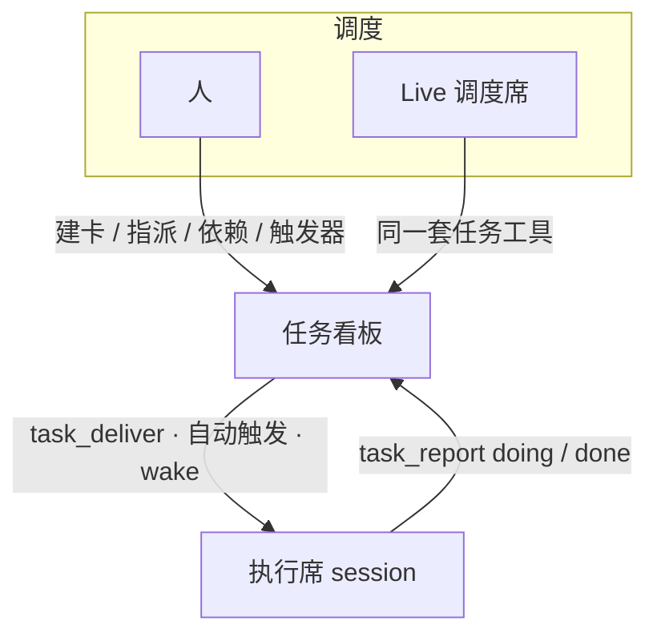
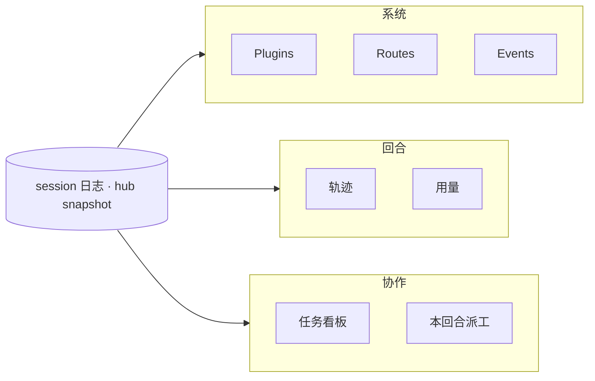
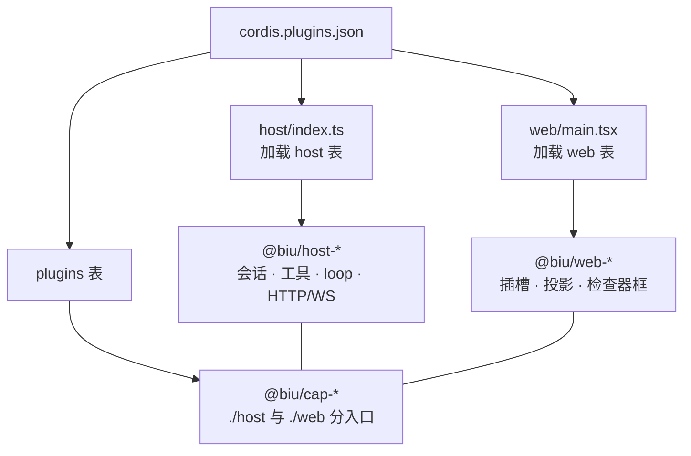

<p align="center">
  
</p>

<h1 align="center">Biu</h1>

<p align="center"><b>一切即插件的 Agent Harness</b></p>
<p align="center">多 Agent 不靠群聊轮流说话，靠任务看板协作。</p>

<p align="center">
  <a href="#1-它是什么">它是什么</a>
  ·
  <a href="#2-三条原则">原则</a>
  ·
  <a href="#3-核心任务看板上的多-agent">多 Agent</a>
  ·
  <a href="#4-harness-怎么被看见">可观测性</a>
  ·
  <a href="#5-运行时怎么拆">设计</a>
  ·
  <a href="#6-跑起来">上手</a>
  ·
  <a href="#许可">许可</a>
</p>

> **Grok Bot 头像可能侵权。** 侧栏那个机器人外形来自 xAI Grok Bot 的学习向几何副本（`public/grok-bot/`），**不在 MIT 授权里**。克隆、演示可以，二次分发或商用前请自己评估，或换成自己的角色。详见 [NOTICE.md](NOTICE.md)。

---

## 1. 它是什么

Biu 不是「聊天窗口外挂几个 tool」。它是一套把 **Agent 当进程、把任务当总线** 的本地工作台：

| | 含义 |
|--|--|
| **Harness** | 运行时、工具、审批、loop、界面都可替换；壳不内置业务 |
| **一切即插件** | HTTP / 会话 / LLM / 对话 / 看板……一律 Cordis 插件，一份 [`cordis.plugins.json`](cordis.plugins.json) |
| **看板协作** | 每个 Agent 是独立 session；人与 Agent 对同一张卡派工、阻塞、汇报 |

关掉 `tasks` 插件，看板、派工工具、心跳一起消失。壳不知道「任务」这个词，只认识插槽。

---

## 2. 三条原则

### 一切即插件

能力靠服务键 `inject`，不绑实现类。主仓 `host/`、`web/` **只加载**，不堆功能。json 三张表：`host` 内核、`web` 壳、`plugins` 可热插拔。包名 `@biu/<prefix>-<id>`，json 里的 `id` 仍是短名（`chat`、`http`）。

### Session 是权威日志

每个 Agent = 一条 append-only session。模型输出、tool、审批、派工，都先写成 `session/event`。浏览器只投影，不持模型能力。投影可以换，日志不能丢。

### 协作对象是任务，不是另一段 prompt

多 Agent 交互发生在看板上：建卡、指派到某个 session、依赖与阻塞、触发派工、`task_report` 写回。这是工作面，不是演示页。

---

## 3. 核心：任务看板上的多 Agent

别人常见的「多 Agent」是一个窗口里几个角色轮流说话。Biu 里 **执行席是独立 session**（各自工作区、模型、工具集），**看板是它们之间的总线**。



Live 管 **现场**（谁在跑、要不要再 wake）；看板管 **工作项**（这件事归谁、卡在哪、何时再派）。多数产品只有群聊，或只有调度、没有这张板。

### 第一次怎么走

1. 开一个 **Live** 会话当调度席，再开一个或多个 **chat** 当执行席。
2. 侧栏打开 **Tasks**，建卡，把负责人指到某个执行席 session。
3. 人或调度席 `task_deliver`（或 cron / `dep:done` / `turn:end` 触发）把执行席 wake 起来。
4. 执行席干活，每回合 `task_report`：还在做传 `doing`，做完传 `done`（进度、说明、当回合用量写在卡上）。
5. 右侧检查器一边看 **轨迹**，一边看同一张 **任务**。上游 `done` 可自动派下游。

### 人和 Agent 摸的是同一张板

| | 人 | Agent |
|--|--|--|
| 建卡 / 改负责人 / 看阻塞 | Tasks UI | `tasks_list` · `tasks_update` |
| 派给某个 session | 指派 `assigneeSessionId` | 同上；执行席必须是真 session，不是角色名 |
| 开工 | 触发器或手动 | `task_deliver` |
| 回报 | 看板上的报告时间线 | `task_report` |
| 现场指挥 | 切到对方会话 | Live：`session_wake` / `session_inject` |

依赖是图：`parentId` / `dependsOn` 派生阻塞链。触发器同一套状态机：`idle → pending → delivered → done`。删掉执行席 session，卡上的 report 还在。

---

## 4. Harness 怎么被看见

Harness 要当场回答四件事：**装了什么、刚 dispatch 了什么、这一回合做了什么、协作卡在哪**——做成运行时表面，而不是事后翻日志。



| 层 | 问题 | 入口 |
|----|------|------|
| 系统 | 哪个插件在跑、能否热卸 | Settings → Plugins |
| 系统 | host 暴露了哪些 HTTP | Settings → Routes |
| 系统 | Cordis 刚刚 dispatch 了什么 | Settings → Events（滤掉 stream chunk） |
| 回合 | 模型 / 工具逐步做了什么 | 检查器 **轨迹**（事件投影，不是另存聊天） |
| 回合 | token 怎么花的 | 检查器 **用量**；`task_report` 会固化当回合消耗 |
| 协作 | 谁在做哪张卡 | Tasks + 检查器任务页；Live 对话里的派工表 |
| 协作 | 这套工具对当前 session 是否有效 | 会话配置 / `GET /api/sessions/:id/inspector` |

插件装卸立刻反映到 snapshot（插件表、路由、工具名）。UI 只订阅，不猜测。

---

## 5. 运行时怎么拆



- **壳只认插槽。** `composer`、`inspector-panels`、`app-modules`、Settings 各栏由能力自己 `place`。Activity Bar 里的 Dashboard / Tasks / Channels 都是 cap 注册的模块。
- **Agent loop 可替换。** `agents` 句柄不变，factory 可换。
- **审批在管线上。** 敏感 tool 进 hold，UI 在 dock，不写进壳。

| 表 | 谁加载 | 能否热卸 |
|----|--------|----------|
| `host` | `host/index.ts` | 否（内核） |
| `web` | `web/main.tsx` | 否（壳） |
| `plugins` | hub + ui-hub | 是 |

```
host/  web/           加载器，不要往这里堆能力
packages/
  type-*              契约，不进 json
  host-*              Node 内核（含 Live 派工）
  web-*               浏览器内核
  cap-*               chat / tasks / dashboard / channels …
cordis.plugins.json   唯一清单
```

加能力：`packages/cap-<id>`，`exports` 分开 `./host` 与 `./web`，写入 `plugins` 表后重启。`type-*`、`web-mascot` 不要进表。细则：[docs/plugin-packages.md](docs/plugin-packages.md)。

---

## 6. 跑起来

需要 Node.js 20+ 和 npm。`main` 与开发分支 `hmr-dev` 当前对齐。

```bash
git clone https://github.com/helloooooooooooooo97/BIU.git
cd BIU
make          # 安装依赖，同时起 host 与 Vite
```

| | 地址 |
|--|------|
| UI | http://127.0.0.1:5173 |
| API / WS | http://127.0.0.1:3141 |

未配 Key 时发消息只会本地回声。打开 **Settings → Models**，或：

```bash
export DEEPSEEK_API_KEY=...     # 或 OPENAI_API_KEY / ANTHROPIC_API_KEY
export CHAT_MODEL=deepseek-chat # 可选
```

配好后按 [§3 第一次怎么走](#第一次怎么走) 开 Live + 执行席，到 Tasks 建卡。

<details>
<summary>命令与环境变量</summary>

| 命令 | |
|------|--|
| `make` / `make restart` | 安装并起两侧 / 先停再起 |
| `make host` / `make web` | 只起一侧 |
| `make stop` | 释放 `3141` / `5173` |
| `npm test` | Vitest |
| `npx tsc --noEmit` | 类型检查 |

也可：`npm run dev:host` 与 `npm run dev:web`。

| 变量 | 默认 | |
|------|------|--|
| `PORT` / `HTTP_HOST` | `3141` / `127.0.0.1` | host 监听 |
| `CORDIS_WORKSPACE` | `.workspace` | 默认工作区 |
| `DEEPSEEK_API_KEY` 等 | | 也可只在 UI 里存 |

</details>

---

## 许可

仓库里 **Biu 自己写的代码和文档** 使用 [MIT License](LICENSE)：可以学习、修改、分发，**也可以商用**，保留版权声明和许可文本即可。

**例外：Grok Bot 机器人。** `public/grok-bot/` 里的几何、动画和角色外形 **不是 MIT**。它们改编自对 Grok Bot.app 的学习向抽取，权利属于 xAI 等权利人，继续使用、打包上线或当产品吉祥物，**有商标 / 版权侵权风险**。本项目不授予这部分的任何权利。说明见 [NOTICE.md](NOTICE.md)。

MIT 软件「按原样」提供，作者不承担质量担保。