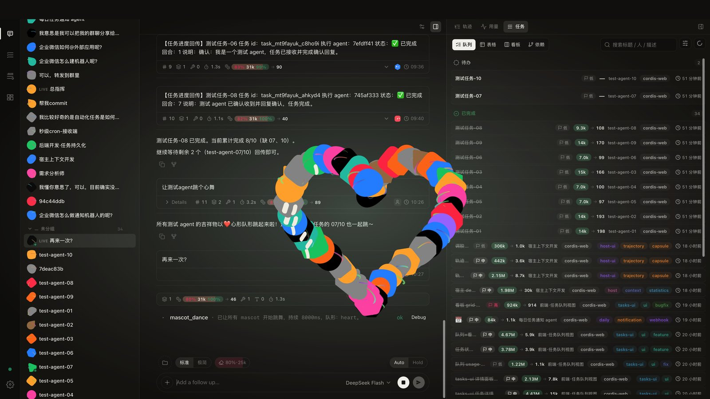
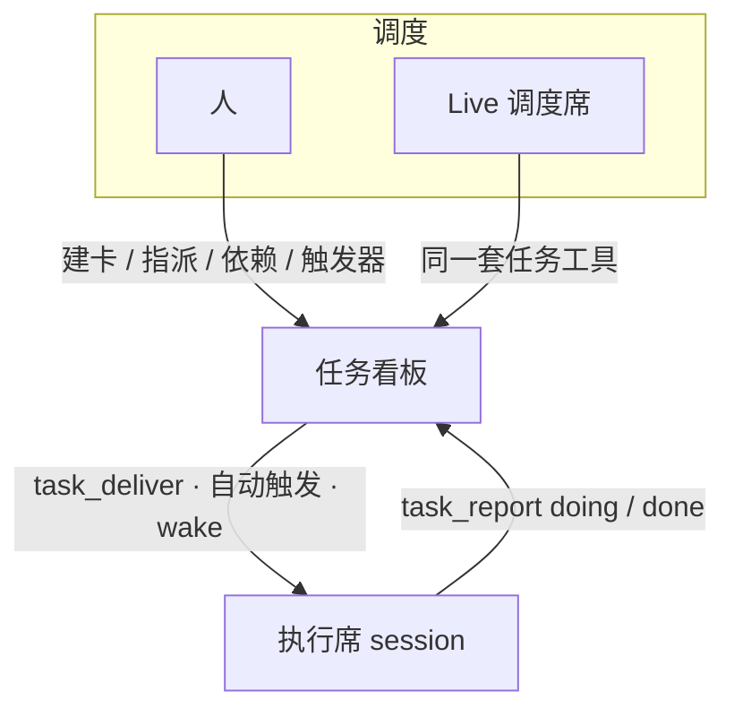
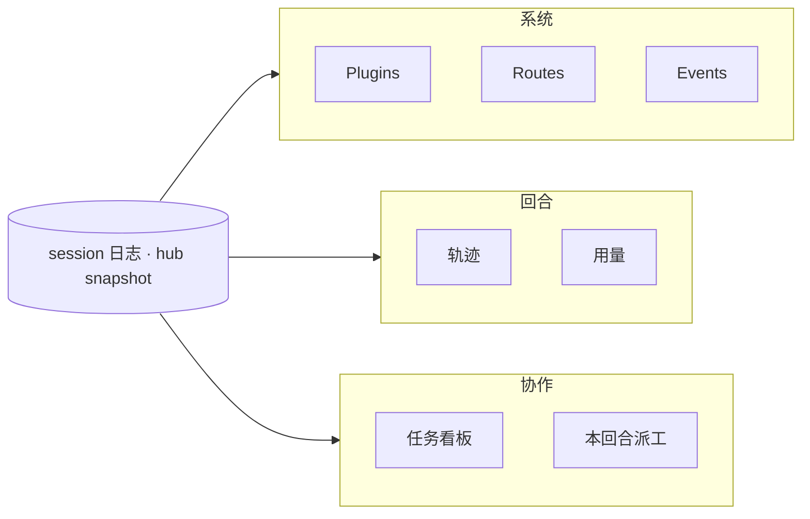
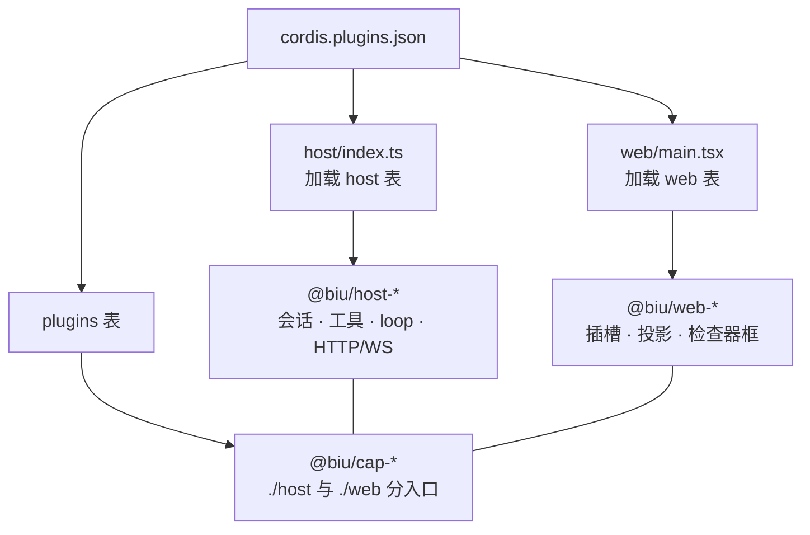

<p align="center">
  
</p>

<h1 align="center">biu-harness</h1>

<p align="center"><b>🧭 天生驾驶者</b></p>

<p align="center">
  
  
  
  
</p>

<p align="center"><b>一切即插件的 Agent Harness</b></p>
<p align="center">多 Agent 不依赖群聊轮流发言，而是通过任务看板协作。</p>

<div align="center">

| 🧩 一切即插件 | 🗂 看板协作 | 🤖 Agent 原生 | 🔍 极致可溯源 |
|---|---|---|---|
| Cordis 内核 · 简单可扩展 | 复杂 Agent 架构任意搭 | 用 Agent 治理 Agent | 事件流 · 一切可回溯 |

</div>

<br>

<p align="center">
  <a href="#四大设计原则">设计原则</a>
  ·
  <a href="#产品演示">演示</a>
  ·
  <a href="#1-任务看板上的多-agent">多 Agent</a>
  ·
  <a href="#2-harness-怎么被看见">可观测性</a>
  ·
  <a href="#3-运行时怎么拆">设计</a>
  ·
  <a href="#4-仓库目录">目录</a>
  ·
  <a href="#5-跑起来">上手</a>
  ·
  <a href="#许可">许可</a>
</p>

> **注意：Grok Bot 头像资产可能涉及侵权。** 侧栏所用的机器人外形来自对 xAI Grok Bot 的学习向几何副本（`public/grok-bot/`），**不在 MIT 授权范围内**。可用于克隆与演示；二次分发或商用前请自行评估，或替换为自有角色。详见 [NOTICE.md](NOTICE.md)。

---

## 四大设计原则

biu-harness 不是「在聊天窗口上附加若干工具」，而是一套把 **Agent 当进程、把任务当总线** 的本地工作台。它的四个核心能力，也即四项基本设计原则：

### 1. 一切即插件

基于 Cordis 内核打造的插件体系。内核与能力分层解耦，每个能力包只声明它需要的服务（通过服务键 `inject`）、不关心具体实现。HTTP / 会话 / LLM / 对话 / 看板……一律是 Cordis 插件，由一份 [`cordis.plugins.json`](cordis.plugins.json) 承载。**代码结构简单、易于扩展**：想换通信、换会话存储、加新能力，都在插槽边界内完成，一行不改内核。

关掉 `tasks` 插件，看板、派工工具、心跳会一并移除——**壳只识别插槽，不理解任何业务概念**。包名遵循 `@biu/<prefix>-<id>`；主仓 `host/`/`web/` 仅负责加载，不内置功能。

### 2. 多 Agent 协作

以 Task 看板为协作总线：建卡、指派到独立执行席、事件驱动派工、进度回报。支持依赖阻塞、定时/事件自动触发、进度自愈追问。复杂协作靠一张张任务卡编排成可跑的流水线，**支持各类复杂 Agent 架构搭建**。

**每个 Agent 是独立 session**（各自拥有工作区、模型、工具集），**看板则是它们之间的总线**——多 Agent 的交互发生在看板上（建卡、指派、依赖/阻塞、触发派工、`task_report` 写回），而非让多个角色在一个窗口轮流发言。这是实际协作的场地，而非演示页面。

### 3. Agent 原生

Agent 本身就是产品的一等操作对象：**Agent 可以接管产品功能，包括新建其他 Agent、给所有 Agent 打标签、巡检状态、编排派工**。多 Agent 系统里的数量与生命周期可被程序化管理——**用 Agent 治理 Agent，防止 Agent 泛滥**，而不是靠人肉去数去管。

### 4. 极致可观测性 · 一切可溯源

biu-harness 的核心日志不是零散的聊天记录或状态快照，而是一条**完整的事件流**——输入、模型输出、每一步工具调用、审批、派工，所有动作都以事件形式落进这条流，一个不落。**观察与执行的底层是同一份事实**：模型下一回合收到的完整上下文，就是从这条流重建的；界面上的任何一屏展示（轨迹、用量、任务派工、检查器）也都只是这条流的投影。

正因如此，一切皆可追溯：

- **每个行为都有据可查。** 这一回合模型说了什么、调了哪些工具、结果如何、经过了怎样的审批、派给了谁，都能沿着事件流逐条还原。
- **可量化、可介入。** 能观测**每一个回合的历史上下文占用**——比如输入里多大比例在重读旧历史、多大比例是新内容，据此判断何时压缩、怎么调窗口，实现精细的上下文管理；想干预长对话，就在流上某个位置插入「压缩点」，后续从那里重放——既能往回追溯，又能往前控制。
- **不丢账、不漂移。** 用量会固化到任务上，删掉执行会话账还在；所有视角读同一份事件流，永远对得上。

> 一句话：**没有一个状态是不知其所以然的，没有一个结论是追溯不到来源的。**

这套设计的基础是：**Session 是权威日志**。每个 Agent = 一条 append-only session，模型输出、tool、审批、派工都先写成 `session/event`。浏览器只负责投影、不持模型能力——**投影可以换，日志不能丢**。

---

## 产品演示

三图覆盖同一套工作面：任务看板、执行席的回合轨迹与 token 用量。

<p align="center">
  
</p>
<p align="center"><sub><code>task.jpg</code> — 多 Agent 在看板上汇报：chat 中进度回传，队列内待办 / 已完成保持对应</sub></p>

<p align="center">
  
</p>
<p align="center"><sub><code>trajectory.jpg</code> — 检查器「轨迹」以事件投影还原单回合完整过程：模型输出、tool 调用、审批、派工</sub></p>

<p align="center">
  
</p>
<p align="center"><sub><code>usage.jpg</code> — 检查器「用量」展示 token 消耗；<code>task_report</code> 会固化当回合用量</sub></p>

---

## 1. 任务看板上的多 Agent

常见的「多 Agent」实现是让一个窗口里的多个角色依次发言。在 biu-harness 中，**执行席是独立 session**（各自拥有工作区、模型、工具集），**看板则是它们之间的总线**。



Live 负责 **现场**（谁在运行、是否需要再次 wake）；看板负责 **工作项**（该事项归属谁、卡在何处、何时再派）。多数产品要么只有会话，要么只有调度，而缺少这样一块看板。

### 首次上手的流程

1. 开一个 **Live** 会话作为调度席，再开一个或多个 **chat** 作为执行席。
2. 在侧栏打开 **Tasks**，建卡，把负责人指派到某个执行席 session。
3. 由人或调度席 `task_deliver`（或通过 cron / `dep:done` / `turn:end` 触发）将执行席 wake 起来。
4. 执行席执行任务，每回合调用 `task_report`：进行中传 `doing`，完成后传 `done`（进度、说明、当回合用量会记录在卡上）。
5. 右侧检查器同时查看 **轨迹** 与对应的 **任务**。上游 `done` 可自动触发下游。

### 人与 Agent 面对的是同一块看板

| | 人 | Agent |
|--|--|--|
| 建卡 / 改负责人 / 看阻塞 | Tasks UI | `tasks_list` · `tasks_update` |
| 派给某个 session | 指派 `assigneeSessionId` | 同上；执行席必须是真 session，不是角色名 |
| 开工 | 触发器或手动 | `task_deliver` |
| 回报 | 看板上的报告时间线 | `task_report` |
| 现场指挥 | 切到对方会话 | Live：`session_wake` / `session_inject` |

依赖是一种图结构：由 `parentId` / `dependsOn` 派生阻塞链。触发器共用同一套状态机：`idle → pending → delivered → done`。删除执行席 session 后，卡上的 report 记录仍会保留。

---

## 2. Harness 怎么被看见

Harness 需要在现场回答四件事：**装了什么、刚 dispatch 了什么、这一回合做了什么、协作停在哪一步**——使之在运行时表面即可呈现，而非事后查阅日志。



| 层 | 问题 | 入口 |
|----|------|------|
| 系统 | 哪个插件在跑、能否热卸 | Settings → Plugins |
| 系统 | host 暴露了哪些 HTTP | Settings → Routes |
| 系统 | Cordis 刚刚 dispatch 了什么 | Settings → Events（滤掉 stream chunk） |
| 回合 | 模型 / 工具逐步做了什么 | 检查器 **轨迹**（事件投影，不是另存聊天） |
| 回合 | token 怎么花的 | 检查器 **用量**；`task_report` 会固化当回合消耗 |
| 协作 | 谁在做哪张卡 | Tasks + 检查器任务页；Live 对话里的派工表 |
| 协作 | 这套工具对当前 session 是否有效 | 会话配置 / `GET /api/sessions/:id/inspector` |

插件装卸立刻反映到 snapshot（插件表、路由、工具名）。UI 只负责订阅，不自行推断。

---

## 3. 运行时怎么拆



- **壳只依赖插槽。** `composer`、`inspector-panels`、`app-modules`、Settings 各栏由能力自己进行 `place`。Activity Bar 里的 Dashboard / Tasks / Channels 都是 cap 注册的模块。
- **Agent loop 可替换。** `agents` 句柄不变，factory 可换。
- **审批位于管线上。** 敏感 tool 进入 hold 状态，审批 UI 停靠在 dock，不并入壳逻辑。

| 表 | 谁加载 | 能否热卸 |
|----|--------|----------|
| `host` | `host/index.ts` | 否（内核） |
| `web` | `web/main.tsx` | 否（壳） |
| `plugins` | hub + ui-hub | 是 |

加能力：`packages/cap-<id>`，`exports` 分开 `./host` 与 `./web`，写入 `plugins` 表后重启。`type-*`、`web-mascot` 不要进表。细则：[docs/plugin-packages.md](docs/plugin-packages.md)。

---

## 4. 仓库目录

根目录只保留加载器与清单；能力全部位于 `packages/`，按前缀即可清晰区分。

```
biu-harness
├── host/                      # Node 加载器：读 json 的 host 表，plugin()
│   ├── index.ts
│   └── types.ts
├── web/                       # 浏览器加载器：读 json 的 web 表
│   ├── main.tsx
│   ├── style.css
│   └── types.ts
├── index.html                 # Vite 入口 → web/main.tsx
├── cordis.plugins.json        # 唯一插件清单（host / web / plugins 三张表）
├── Makefile                   # make / make stop / make restart
├── vite.config.ts
├── LICENSE                    # MIT（不含 Grok Bot 角色资产）
├── NOTICE.md                  # 第三方角色声明
├── docs/
│   ├── plugin-packages.md     # 包前缀与入口约定
│   └── demo/                  # README 截图：task / trajectory / usage
├── scripts/
│   └── link-cordis-plugins.mjs
├── public/
│   ├── favicon.svg
│   └── grok-bot/              # 非 MIT：xAI 角色几何副本
└── packages/
    ├── type-session/          # 契约，不进 json
    ├── type-http/
    ├── type-slots/
    ├── type-agent-loop/
    ├── type-host-context/
    │
    ├── host-plugin-loader/    # 解析 json、Vite virtual 模块
    ├── host-http/             # HTTP / WS
    ├── host-session-store/
    ├── host-sessions/         # append-only session + ALS
    ├── host-tools/
    ├── host-llm/
    ├── host-system-prompt/
    ├── host-fs/
    ├── host-sandbox/
    ├── host-subprocess/
    ├── host-shell/
    ├── host-jobs/
    ├── host-mcp/
    ├── host-terminal/
    ├── host-lsp/
    ├── host-context/
    ├── host-approvals/
    ├── host-agent-loop/
    ├── host-agents/
    ├── host-subagents/
    ├── host-live-sessions/    # Live 派工（不是任务插件）
    ├── host-hub/              # 挂 plugins 表、snapshot
    │
    ├── web-slots/
    ├── web-app-modules/
    ├── web-session-view/
    ├── web-project-view/
    ├── web-snapshot/
    ├── web-react-host/
    ├── web-app-shell/         # 应用壳、检查器框
    ├── web-plugin-tree/       # Settings → Plugins
    ├── web-event-log/         # Settings → Events
    ├── web-routes-panel/      # Settings → Routes
    ├── web-ui-hub/
    ├── web-mascot/            # 共享库，不进 json
    │
    ├── cap-chat/              # 对话 + 轨迹 / 用量
    ├── cap-tasks/             # 看板 + 心跳 + 派工 / 汇报
    ├── cap-dashboard/
    ├── cap-channels/
    ├── cap-logger/
    └── cap-mascot-easter-egg/
```

每个 `host-*` / `web-*` / `cap-*` 源码在 `src/host/` 和（或）`src/web/`。`cap-*` 的 `package.json` 必须分开 `exports["./host"]` 与 `exports["./web"]`。

---

## 5. 跑起来

需要 Node.js 20+ 和 npm。`main` 与开发分支 `hmr-dev` 当前对齐。

```bash
git clone https://github.com/helloooooooooooooo97/biu-harness.git
cd biu-harness
make          # 安装依赖，同时起 host 与 Vite
```

| | 地址 |
|--|------|
| UI | http://127.0.0.1:5173 |
| API / WS | http://127.0.0.1:3141 |

未配置 Key 时，发送消息只会得到本地回声。请打开 **Settings → Models**，或：

```bash
export DEEPSEEK_API_KEY=...     # 或 OPENAI_API_KEY / ANTHROPIC_API_KEY
export CHAT_MODEL=deepseek-chat # 可选
```

配置完成后，按 [§1 首次上手的流程](#首次上手的流程) 启动 Live 与执行席，再到 Tasks 建卡。

<details>
<summary>命令与环境变量</summary>

| 命令 | |
|------|--|
| `make` / `make restart` | 安装并起两侧 / 先停再起 |
| `make host` / `make web` | 只起一侧 |
| `make stop` | 释放 `3141` / `5173` |
| `npm test` | Vitest |
| `npx tsc --noEmit` | 类型检查 |

也可：`npm run dev:host` 与 `npm run dev:web`。

| 变量 | 默认 | |
|------|------|--|
| `PORT` / `HTTP_HOST` | `3141` / `127.0.0.1` | host 监听 |
| `CORDIS_WORKSPACE` | `.workspace` | 默认工作区 |
| `DEEPSEEK_API_KEY` 等 | | 也可只在 UI 里存 |

</details>

---

## 许可

仓库里 **biu-harness 自己写的代码和文档** 使用 [MIT License](LICENSE)：可以学习、修改、分发，**也可以商用**，保留版权声明和许可文本即可。

**例外：Grok Bot 机器人。** `public/grok-bot/` 里的几何、动画和角色外形 **不是 MIT**。它们改编自对 Grok Bot.app 的学习向抽取，权利属于 xAI 等权利人。可用于克隆与演示；二次分发、打包上线或当产品吉祥物前，**有商标 / 版权侵权风险**，请自行评估，或替换为自有角色。本项目不授予这部分的任何权利。说明见 [NOTICE.md](NOTICE.md)。

MIT 软件「按原样」提供，作者不承担质量担保。